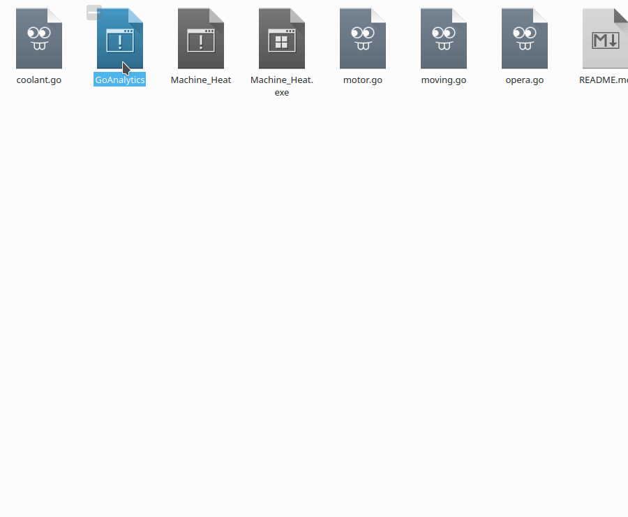

# goAnalytics

Golang解析器

解析檔案夾內Go程式的結構



## 結構

```c

main.go  //程式主檔案

tfile.go  
　　tfile　//檔案的物件  
　　　2 properties　//兩個屬性  
　　　name　　　    //檔名  
　　　objects　　     //檔案內的物件  
　　　2 functions　  //兩個方法  
　　　getObj　　　  //取的檔案內的物件  
　　　show　　　     //顯示此文件的物件  

tobject.go  
　　tobject  //struct的物件  
　　　　3 properties  
　　　　name //物件名稱  
　　　　properties　//物件屬性  
　　　　function //物件方法  
　　　　3 functions  
　　　　getName //取得物件的名稱  
　　　　getProp  //取得物件的屬性
　　　　getFunc  //取的物件的方法
```

## Version

### Unlease

struct的巢狀宣告方式要可以偵測

```go
type Wheel struct{
    Spokes int
    Circle strcut{
        Center point
        Radius int
    }
}
```

----

### [1.0.0] 2020.04.26

- 基本功能測試正常
